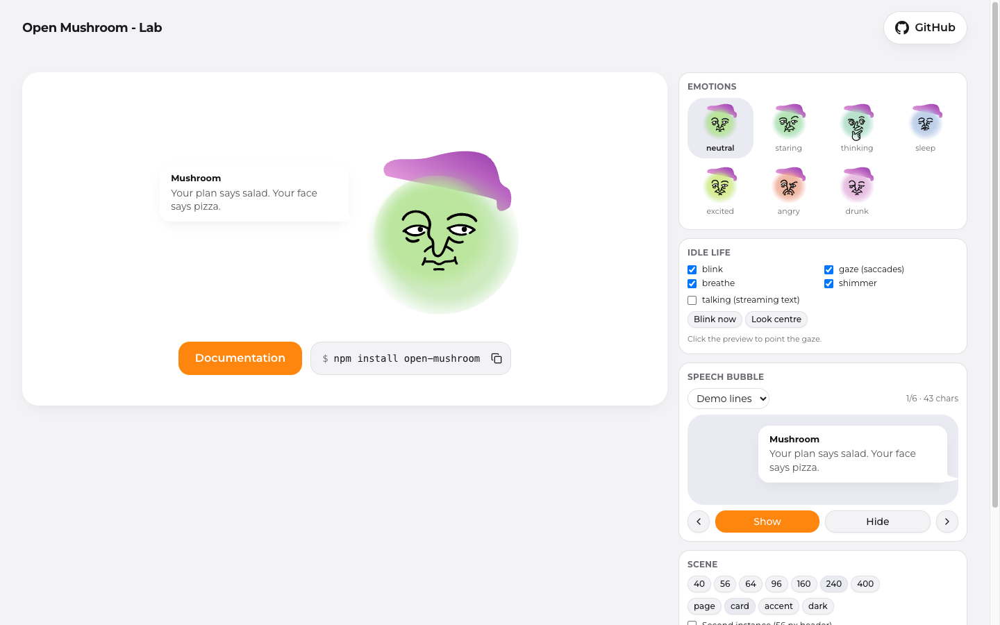

# Open Mushroom

[](https://www.npmjs.com/package/open-mushroom)
[](https://github.com/wallwhite/open-mushroom/actions/workflows/ci.yml)
[](./LICENSE)

Mushroom Gennadiyovych is a living SVG mascot for React: seven emotions that morph into each other, an idle
life (blinks, gaze, breathing, shimmer), a talking mouth for streamed text, and a speech bubble. The face is
server-rendered as plain SVG; GSAP arrives after mount.



## Quick start

```bash
npm install open-mushroom gsap
```

```tsx
import { Mushroom, MushroomSpeechBubble } from 'open-mushroom';
import { MUSHROOM_BUBBLE_ANCHOR } from 'open-mushroom/core';
import 'open-mushroom/styles.css'; // only the bubble needs it

export const Hero = () => (
  <div style={{ position: 'relative', marginLeft: '17rem' }}>
    <div style={{ position: 'absolute', ...MUSHROOM_BUBBLE_ANCHOR }}>
      <MushroomSpeechBubble text="Water first. Then we discuss the cookies." visible speaker="Mushroom" />
    </div>
    <Mushroom emotion="excited" size={240} />
  </div>
);
```

- `emotion`: `neutral | staring | thinking | sleep | excited | angry | drunk`; a change morphs the face.
- `size`: CSS pixels; small sizes get a thicker ink stroke on their own.
- `idle`: `true` (default), `false` for a still, or `{ blink, gaze, breathe, shimmer }`.
- `talking`: mouth chatter while text streams in.
- `ref`: `blink()`, `lookAt(dx, dy)`, `getSnapshot()`.

Components come from `open-mushroom` (a client module); constants such as `MUSHROOM_EMOTIONS` come from
`open-mushroom/core`, which is safe to import in React Server Components.

## Mushroom Lab

The lab is the playground and the documentation site: every emotion, the idle layers, the bubble and the
scene controls on the home page, and a documentation section in English and Ukrainian with live examples.

```bash
pnpm install
pnpm dev        # the lab on http://localhost:3001, package served from its sources
```

## Repository

| Path                                    | What                                                        |
| --------------------------------------- | ----------------------------------------------------------- |
| `packages/open-mushroom`                | The npm package: `src/core` (framework-free) + `src/react`  |
| `packages/open-mushroom/tools/skeleton` | The pipeline that turns the artwork into the face manifests |
| `packages/open-mushroom/assets`         | The source exports and how the skeleton is built            |
| `apps/lab`                              | Mushroom Lab (Next.js): playground and docs                 |
| `docs`                                  | Internal documentation: architecture, standards, roadmap    |

```bash
pnpm check           # lint, format, typecheck, test (the package is compiled first)
pnpm build           # package, then the lab
pnpm mushroom:check  # rebuild the face manifests and fail on any difference
```

Node 22 and pnpm 10 (`.nvmrc`, `packageManager`). Releases are versioned with Changesets; see
[CONTRIBUTING.md](./CONTRIBUTING.md).

## Licenses

- Code: [MIT](./LICENSE)
- GSAP is a peer dependency under the GSAP Standard License (no charge); MorphSVGPlugin ships in the public
  `gsap` package
